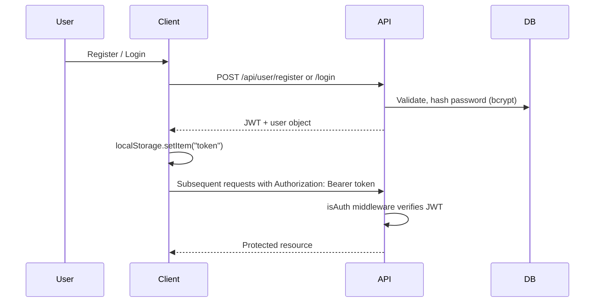

# 🛍️ NOVA STONE & CO.

> Full-stack fashion e-commerce platform — React (Vite) storefront + Express/MongoDB REST API, with JWT auth, a complete checkout flow, and an admin dashboard.

[](LICENSE)


### 🔗 Quick Links

| | |
|---|---|
| 🌐 **Live Frontend** | [ecommerce-platform-f4qc.vercel.app](https://ecommerce-platform-f4qc.vercel.app/) |
| ⚙️ **Live API** | [ecommerce-platform-production-81f5.up.railway.app](https://ecommerce-platform-production-81f5.up.railway.app) |
| 📦 **Repository** | [github.com/adarshdhauni/ecommerce-platform](https://github.com/adarshdhauni/ecommerce-platform) |

---

## 📋 Table of Contents

- [Overview](#overview)
- [Motivation](#motivation)
- [Features](#features)
- [Tech Stack](#tech-stack)
- [Architecture Overview](#architecture-overview)
- [Folder Structure](#folder-structure)
- [Screenshots](#screenshots)
- [Responsive Design](#responsive-design)
- [Installation](#installation)
- [Environment Variables](#environment-variables)
- [Running Locally](#running-locally)
- [API Overview](#api-overview)
- [Authentication Flow](#authentication-flow)
- [Database Schema](#database-schema)
- [State Management](#state-management)
- [Performance Optimizations](#performance-optimizations)
- [Security Features](#security-features)
- [Accessibility](#accessibility)
- [Error Handling](#error-handling)
- [Deployment](#deployment)
- [Testing](#testing)
- [Challenges Faced](#challenges-faced)
- [Lessons Learned](#lessons-learned)
- [Future Improvements](#future-improvements)
- [Contributing](#contributing)
- [License](#license)
- [Author](#author)

---

## 📖 Overview

NOVA STONE & CO. is a full-stack fashion e-commerce application covering the complete retail loop — product browsing, cart, multi-step checkout, order tracking, reviews, and wishlists — backed by a dedicated admin panel for managing products, orders, and users.

| | |
|---|---|
| **Type** | Full-stack e-commerce (fashion / apparel) |
| **Architecture** | SPA frontend + REST API backend |
| **Frontend** | React 19, Vite 7, React Router 7 |
| **Backend** | Express 5, Mongoose 8, MongoDB |
| **Auth** | JWT (Bearer token, 7-day expiry) |
| **Payments** | Simulated — stores card metadata only (last 4 digits, expiry); no live payment processor |
| **Scope** | ~196 files across storefront, checkout, admin panel, reviews, wishlist, and order management |

---

## 💡 Motivation

This project was built as a solo, year-long learning exercise. Every layer of the stack — frontend, backend, authentication, admin tooling, and security middleware — was learned while being built, with the goal of producing a production-style portfolio piece rather than a tutorial clone.

The aim was to implement the full retail loop end-to-end: not just a product list and a cart, but real checkout logic, an order status lifecycle, role-based admin access, and the security and performance concerns that come with a real e-commerce surface area.

---

## ✨ Features

### 🛒 Storefront (User-Facing)

- **Home** — hero banner, category navigation, featured collection, recently viewed, editorial content
- **Product Catalog** — search, filters, sorting, pagination, and a quick-view modal
- **Product Detail** — image gallery, size/stock selection, wishlist toggle, related products, and reviews
- **Cart** — client-persisted cart with coupon codes and an order note (up to 500 characters)
- **Checkout** — 3-step flow: shipping → payment → confirmation
- **Profile & Orders** — editable profile, paginated order history, order detail with a status timeline, and cancellation
- **Wishlist & Recently Viewed** — persisted on the user document
- **Reviews** — one review per product per user, including post-delivery reviews from the order detail page
- **Static Pages** — About, Contact, FAQ, Shipping & Returns, Store Policy
- **Newsletter & Contact** — footer subscription form and a contact form

<details>
<summary><strong>Checkout flow</strong></summary>
<br>

```mermaid
flowchart LR
    A[Cart] --> B{Logged in?}
    B -->|No| C[/auth]
    B -->|Yes| D[Step 1: Shipping]
    D --> E[Step 2: Payment]
    E --> F[POST /api/orders/place]
    F --> G[Step 3: Confirmation]
    G --> H[Clear cart + checkout state]
```

- Tax is calculated server-side at 10% per line item
- Two coupon codes are supported: `NOVA10` (10% off, $200 minimum) and `NOVA20` (20% off, $500 minimum)
- Only the last 4 digits of a payment card are sent to the API — no full card number is ever stored
- Estimated delivery is set to 5 days from order placement
- The confirmation page auto-redirects to `/products` after 8 seconds

</details>

### 🛠️ Admin Panel

| Section | Capabilities |
|---|---|
| **Dashboard** | Total orders / users / products, revenue (delivered orders only), 5 most recent orders, low-stock alerts (≤5 units), top 5 sellers |
| **Products** | Search and filter by gender & category, create, edit, delete |
| **Orders** | Search by order ID or user, filter by status, view detail, update status |
| **Users** | Search and filter by role, view detail with paginated order history and spend stats |

- **Order status flow:** `Placed → Processing → Shipped → Out for Delivery → Delivered` (or `Cancelled`) — no backward transitions; `Delivered` / `Cancelled` are terminal
- Admin access requires **both** `role: "Admin"` and `isAdmin: true` to align on the user document

---

## 🛠️ Tech Stack

### Frontend

| Category | Stack |
|---|---|
| Core | React 19, React DOM, Vite 7 |
| Routing | React Router DOM 7 |
| State | Redux Toolkit, React-Redux, RTK Query |
| Styling | Tailwind CSS 3, tailwindcss-animate, tailwind-scrollbar |
| UI Components | Radix UI (Dialog, Tabs, Select, Accordion, Toast), shadcn-style components |
| Animation | Framer Motion |
| Icons | Lucide React |
| HTTP | Axios (via RTK Query `fetchBaseQuery`) |
| Utilities | clsx, tailwind-merge, class-variance-authority |
| Resilience | react-error-boundary |

### Backend

| Category | Stack |
|---|---|
| Runtime | Node.js, Express 5 |
| Database | MongoDB, Mongoose 8 |
| Auth | jsonwebtoken, bcryptjs |
| Security | helmet, cors, express-rate-limit, hpp, @exortek/express-mongo-sanitize |
| Email | Resend |
| IDs | nanoid (custom alphabet for human-readable order IDs) |
| Config | dotenv |

### Third-Party Services

| Service | Usage |
|---|---|
| MongoDB | Primary database |
| Resend | Password reset emails |
| External image URLs | Product images (CDN-hosted, no upload endpoint) |

No Stripe, PayPal, Cloudinary, or OAuth providers are integrated — payments are simulated and product images are sourced from external URLs.

---

## 🏗️ Architecture Overview

NOVA STONE & CO. is a monorepo-style project split into two independently deployable apps, with no root `package.json`:

- **`client/`** — a React SPA that communicates with the API exclusively through RTK Query
- **`server/`** — a stateless Express REST API backed by MongoDB

The frontend has no server-side rendering and holds no persisted server state; all session state lives in `localStorage` / `sessionStorage`, and the backend authenticates every protected request via a Bearer JWT.

| Layer | Mechanism |
|---|---|
| **Public** | Products, featured items, search, reviews (read), contact, subscribe |
| **Authenticated** | Profile, wishlist, shipping, payment, orders, reviews (write), recently viewed |
| **Admin** | `protect` + `adminOnly` middleware, scoped via `role` and `isAdmin` |

Resource ownership (orders, addresses, payments, reviews) is enforced by scoping every query to `req.user._id`. See [Authentication Flow](#authentication-flow) for the full request sequence.

---

## 📁 Folder Structure

<details>
<summary>Click to expand</summary>

```
ecommerce-platform/
├── client/
│   ├── public/
│   ├── src/
│   │   ├── components/
│   │   │   ├── admin/
│   │   │   ├── auth/
│   │   │   ├── cart/
│   │   │   ├── checkout/
│   │   │   ├── product/ & productCard/
│   │   │   ├── products/
│   │   │   ├── order/
│   │   │   ├── modals/
│   │   │   ├── ui/                   # shadcn/Radix primitives
│   │   │   ├── loadingStates/
│   │   │   ├── EmptyState/ & ErrorState/
│   │   │   ├── navbar/ & footer/
│   │   │   ├── protectedRoute/ & adminRoute/
│   │   │   └── globalComponents/
│   │   ├── context/
│   │   │   └── FilterContext.jsx
│   │   ├── data/
│   │   │   └── faqData.js
│   │   ├── hooks/
│   │   │   └── use-toast.js
│   │   ├── pages/
│   │   │   ├── auth/                 # Login, register, forgot/reset password
│   │   │   ├── user/                 # Home, Products, Product, Cart, Checkout, etc.
│   │   │   ├── admin/                 # Dashboard, Products, Orders, Users
│   │   │   └── notFound/
│   │   ├── redux/
│   │   │   ├── api/apiSlice.js        # RTK Query — all API calls
│   │   │   ├── cart/cartSlice.js
│   │   │   └── store/store.js
│   │   ├── App.jsx                    # Router + layouts
│   │   └── main.jsx
│   ├── components.json                # shadcn/ui config
│   ├── jsconfig.json                  # @ path alias
│   ├── tailwind.config.js
│   └── vite.config.js
└── server/
    ├── controllers/                   # 10 controllers
    ├── middlewares/                   # isAuth, isAdmin, errorHandler
    ├── models/                        # 8 Mongoose models
    ├── routes/                        # 11 route files
    ├── seed/                          # Product seed data
    ├── utils/                         # sendEmail, orderUtils, constants
    └── server.js                      # Entry point
```

</details>

---

## 📸 Screenshots

| | |
|---|---|
| **Home** <br>  | **Products** <br>  |
| **Product Details** <br>  | **Cart** <br>  |
| **Checkout** <br>  | **Profile** <br>  |
| **Admin Dashboard** <br>  | |

---

## 📱 Responsive Design

- **Mobile-first** Tailwind breakpoints (`sm`, `md`, `lg`, `xl`)
- **Navbar** — hamburger menu + slide-out modal on mobile, full nav on `md+`
- **Product grids** — horizontal scroll-snap on mobile, grid layout on `sm` / `lg`
- **Filters** — sticky sidebar on `lg+`, modal overlay on smaller screens
- **Admin panel** — collapsible drawer sidebar on mobile, fixed sidebar on desktop
- **Checkout** — stacked layout on mobile, side-by-side order summary on `lg+`

---

## ⚙️ Installation

```bash
# Clone the repository
git clone https://github.com/adarshdhauni/ecommerce-platform.git
cd ecommerce-platform

# Install backend dependencies
cd server
npm install

# Install frontend dependencies
cd ../client
npm install
```

---

## 🔐 Environment Variables

### Server — `server/.env`

| Variable | Required | Description |
|---|---|---|
| `MONGO_URI` | ✅ | MongoDB connection string |
| `JWT_SECRET` | ✅ | Secret used to sign JWTs |
| `CLIENT_URL` | ✅ (prod) | CORS origin + password reset link base |
| `RESEND_API_KEY` | ✅ | Resend API key for sending emails |
| `PORT` | – | Server port (default `3000`) |
| `NODE_ENV` | – | Set to `development` to enable `/api/seed/products` |

### Client — `client/.env`

| Variable | Required | Description |
|---|---|---|
| `VITE_API_URL` | – | API base URL (default `http://localhost:3000`) |

---

## ▶️ Running Locally

```bash
# Start the backend (from /server)
npm start

# Start the frontend (from /client, in a separate terminal)
npm run dev
```

- Backend runs on `http://localhost:3000` by default
- Frontend (Vite dev server) runs on `http://localhost:5173` by default

---

## 🔌 API Overview

Base path: `/api`

### Public — Products

| Method | Path | Description |
|---|---|---|
| GET | `/products` | List with filters, sort, pagination |
| GET | `/products/search-suggestions` | Search autocomplete |
| GET | `/featured-products` | Featured products |
| GET | `/products/:id` | Product detail |
| GET | `/products/:id/related` | Related products |

### Orders

| Method | Path | Auth |
|---|---|---|
| POST | `/orders/place` | ✅ |
| GET | `/orders/my-orders` | ✅ |
| GET | `/orders/:id` | ✅ |
| PATCH | `/orders/cancel/:id` | ✅ |

<details>
<summary><strong>Users, Reviews, Wishlist, Shipping & Payment</strong></summary>
<br>

#### Users
| Method | Path | Auth | Rate Limit |
|---|---|---|---|
| POST | `/user/register` | – | 5 / 10 min |
| POST | `/user/login` | – | 5 / 10 min |
| POST | `/user/forgot-password` | – | 5 / 10 min |
| POST | `/user/reset-password/:token` | – | 5 / 10 min |
| GET | `/user/profile` | ✅ | – |
| PUT | `/user/profile` | ✅ | – |
| PUT | `/user/update-password` | ✅ | – |
| POST | `/user/recently-viewed/:productId` | ✅ | – |
| GET | `/user/recently-viewed` | ✅ | – |

#### Reviews
| Method | Path | Auth |
|---|---|---|
| GET | `/products/:productId/reviews` | – |
| GET | `/products/reviews/my` | ✅ |
| POST | `/products/:productId/reviews` | ✅ (20 / 15 min) |
| DELETE | `/products/:productId/reviews/:reviewId` | ✅ |

#### Wishlist
| Method | Path | Auth |
|---|---|---|
| GET | `/wishlist` | ✅ |
| POST | `/wishlist/:productId` | ✅ (toggle) |

#### Shipping
| Method | Path | Auth | Rate Limit |
|---|---|---|---|
| POST | `/shipping/add` | ✅ | 5 / 10 min |
| GET | `/shipping/my-addresses` | ✅ | – |
| DELETE | `/shipping/:id` | ✅ | – |

#### Payment
| Method | Path | Auth | Rate Limit |
|---|---|---|---|
| POST | `/payment/add` | ✅ | 5 / 10 min |
| GET | `/payment/saved` | ✅ | – |
| DELETE | `/payment/:id` | ✅ | – |

</details>

<details>
<summary><strong>Admin & other endpoints</strong></summary>
<br>

#### Admin (requires Auth + Admin role)
| Method | Path |
|---|---|
| GET | `/admin/stats` |
| GET | `/admin/orders/recent` |
| GET | `/admin/orders` |
| GET | `/admin/orders/:id` |
| PATCH | `/admin/orders/status-update` |
| GET | `/admin/products` |
| POST | `/admin/products/add` |
| PUT | `/admin/products/edit/:id` |
| DELETE | `/admin/products/delete/:id` |
| GET | `/admin/users` |
| GET | `/admin/users/:id` |
| GET | `/admin/dashboard/analytics` |

#### Other
| Method | Path | Auth | Rate Limit |
|---|---|---|---|
| POST | `/contact` | – | 5 / 10 min |
| POST | `/subscribe` | – | 5 / 10 min |
| POST | `/seed/products` | Admin | Dev only |

</details>

---

## 🔑 Authentication Flow



### Registration — `POST /api/user/register`
- Validates email format, Indian 10-digit phone numbers (prefix `6`–`9`), and password strength (8–64 characters, upper/lowercase, number, special character)
- Checks for duplicate email/phone before creating the account
- Passwords are hashed with bcrypt (10 rounds)
- Returns a JWT immediately on success

### Login — `POST /api/user/login`
- Account lockout after 5 failed attempts (15-minute lock via `loginAttempts` / `lockUntil`)

### Password Reset
1. `POST /api/user/forgot-password` — sends a reset link via Resend
2. Token is a 32-byte hex string, SHA-256 hashed in the database, expires in 10 minutes
3. `POST /api/user/reset-password/:token` — sets the new password

### Session Handling (Client)
- JWT stored in `localStorage`; RTK Query attaches it as a Bearer token on every request via `prepareHeaders`
- A `401` response clears storage and redirects to `/auth` with a session-expired message
- `ProtectedRoute` only checks for token presence (no server-side validation on route entry)
- `AdminRoute` calls `GET /api/user/profile` and checks `isAdmin` + `role` before rendering

---

## 🗄️ Database Schema

MongoDB collections: `User`, `Product`, `Order`, `Review`, `Shipping`, `Payment`, `Contact`, `Subscription`.

<details>
<summary><strong>View model fields</strong></summary>
<br>

**User**
```
name, phone (unique), email (unique), password (hidden by default)
wishlist[], recentlyViewed[]
loginAttempts, lockUntil
passwordResetToken, passwordResetExpires
role (Admin | User), isAdmin
```

**Product**
```
name, price, description, productInfo[]
ratingsAverage, ratingsCount
category, gender, images[], sizes[{ size, stock, sold }]
sold, isFeatured
```

**Order**
```
orderId (unique, nanoid), userId, shippingAddressId, paymentId
items[{ productId, quantity, size, name, basePrice, taxRate, taxPrice, total }]
note, coupon{ code, discountAmount }
subtotalAmount, totalAmount, taxAmount, finalAmount
status, timestamps per status, deliveryDate, isPaid, paidAt
```

**Review**
```
content, rating, product, user
unique index: (product, user)
```

**Shipping**
```
userId, fullName, phone, address1, address2, landmark
postalCode, city, state
```

**Payment**
```
userId, name, last4, month, year
index: (userId, last4)
```

**Contact**
```
firstName, lastName, email, message, createdAt
```

**Subscription**
```
email (unique)
```

</details>

---

## 🧠 State Management

| Store | Purpose |
|---|---|
| RTK Query (`apiSlice`) | All server data — products, auth, orders, admin, reviews, wishlist |
| Redux `cart` slice | Cart items, synced with `localStorage` |
| `FilterContext` | Filter UI state (modal open/close, slider values); the URL is the source of truth on the Products page |
| `localStorage` | Token, cart items, checkout drafts, coupon, order note, checkout step |
| `sessionStorage` | Auth-expiry messages |

**RTK Query features in use:** tag-based cache invalidation, `refetchOnFocus`, `refetchOnReconnect`, and optimistic wishlist updates on the Product page.

---

## ⚡ Performance Optimizations

| Optimization | Where |
|---|---|
| Code splitting | `React.lazy()` for routes and heavy modals |
| Suspense | Global loader + per-modal fallbacks |
| Memoization | `memo()` on Filter, Navbar, ProductCard, etc. |
| Debounced search | 300ms on the Products page |
| Pagination | Server-side for products, orders, reviews, and admin lists |
| Image optimization | `srcSet`, `loading="lazy"`, `decoding="async"`, explicit width/height |
| Scroll optimization | `requestAnimationFrame` for the navbar scroll listener, `{ passive: true }` |
| Query limits | Max 50 items per page on the server |
| Lean queries | `.lean()` used in analytics and search-suggestion queries |

---

## 🔒 Security Features

### Backend
- **Helmet** — secure HTTP headers
- **CORS** — whitelist (`localhost:5173`, `CLIENT_URL`), credentials enabled
- **Rate limiting** — applied to auth, contact, subscribe, shipping, payment, and review routes
- **NoSQL injection protection** via Mongo sanitization
- **HPP** — HTTP parameter pollution protection (whitelisted: `category`, `gender`)
- **Body size limit** — 10kb on JSON/urlencoded payloads
- **Account lockout** — 5 failed login attempts → 15-minute lock
- **Password policy** — enforced strength rules on register, reset, and change
- **JWT expiry** — 7 days, with explicit `TokenExpiredError` handling
- **Hashed reset tokens** — SHA-256, 10-minute expiry
- **Ownership checks** — orders, addresses, payments, and reviews are scoped to the authenticated user

### Frontend
- Token cleared from storage on any `401` response
- Route-level protection via `ProtectedRoute` / `AdminRoute`
- Client-side validation before every API call
- Only the last 4 digits of a payment card are ever sent to the server

> **Known gaps:** `xss-clean` and `multer` are listed as dependencies but not wired into `server.js`; there are no CSRF tokens or refresh tokens; `ProtectedRoute` checks token *presence* only, not validity. See [Future Improvements](#future-improvements).

---

## ♿ Accessibility

| Feature | Implementation |
|---|---|
| Semantic HTML | `<main>`, `<nav>`, `<footer>`, labeled form inputs |
| Accessible primitives | Radix UI dialogs, tabs, and accordions with keyboard support and focus trapping |
| Focus management | `focus-visible:ring-*` on interactive elements; auto-focus on checkout validation errors |
| ARIA | Labels on cart, profile, pagination, and select admin actions |
| Keyboard navigation | Supported throughout via Radix components |
| Contrast | High-contrast black/white visual design |
| Language | `<html lang="en">` |

> Skip links, toast live regions, and `prefers-reduced-motion` support are not yet implemented — tracked in [Future Improvements](#future-improvements).

---

## 🚨 Error Handling

- Centralized `errorHandler` middleware on the backend
- JWT-specific handling for `TokenExpiredError`
- `react-error-boundary` wraps the frontend for component-level failure isolation
- Dedicated `EmptyState` and `ErrorState` components for empty/failed data states
- A `401` response clears the stored token and redirects to `/auth` with a session-expired message

---

## 🚀 Deployment

Live at:
- **Frontend** → [Vercel](https://ecommerce-platform-f4qc.vercel.app/)
- **Backend** → [Railway](https://ecommerce-platform-production-81f5.up.railway.app)

The repository doesn't include Docker, CI/CD, or `.env.example` files — both apps were deployed manually:

1. **Backend** — deployed to Railway (`npm start` from `/server`); environment variables set as listed [above](#environment-variables)
2. **Frontend** — deployed to Vercel (`npm run build` from `/client`); `VITE_API_URL` set to the live backend URL
3. **CORS** — `CLIENT_URL` on the backend points to the deployed frontend origin

To deploy your own instance, repeat the steps above against your own Railway/Render and Vercel/Netlify accounts (or any equivalent Node host + static host).

---

## 🧪 Testing

No automated tests are currently implemented — this was a solo, time-boxed learning project, and testing infrastructure was deprioritized in favor of shipping the full feature set. All testing so far has been manual: exercising each flow (auth, cart, checkout, order lifecycle, admin actions) by hand.

Adding API integration tests and frontend component/E2E coverage is the top item in [Future Improvements](#future-improvements).

---

## 🧗 Challenges Faced

- **Learning while building** — the entire stack (auth, state management, REST API design, MongoDB schema design, security middleware) was learned on the job over the course of building this project, rather than applied from prior experience
- **Auth from scratch** — implementing JWT issuance, bcrypt hashing, login lockout, and a hashed-token password reset flow required understanding each piece well enough to reason about its security trade-offs, not just follow a tutorial
- **End-to-end order logic** — keeping cart state, stock decrementing, coupon validation, and snapshot pricing consistent across a multi-step checkout meant the client and server had to agree on a lot of shared rules
- **Solo scope** — covering a storefront *and* an admin panel *and* a REST API alone meant constantly switching context between frontend UX concerns and backend data/security concerns

---

## 📚 Lessons Learned

- Building the full retail loop end-to-end (not just CRUD) surfaced real-world edge cases — stock running out mid-checkout, terminal order statuses, ownership checks — that a smaller-scoped project wouldn't have forced
- Security is easiest to bake in early — rate limiting, sanitization, and ownership scoping were far simpler to add as each route was built than they would have been to retrofit
- State management benefits from being deliberate about *where* state lives — server data in RTK Query, cart in Redux, ephemeral UI state in context — rather than defaulting everything to one store
- A working app and a *finished* app are different things — deployment configs, tests, and `.env.example` files are easy to deprioritize under solo time constraints, and that gap is now the clearest roadmap for what's next

---

## 🗺️ Future Improvements

### High Priority
- [ ] Real payment integration (Stripe/Razorpay) with PCI-compliant handling
- [ ] Image upload — wire `multer` + cloud storage (S3/Cloudinary)
- [ ] Deployment pipeline — Docker, CI/CD, `.env.example`
- [ ] Automated tests — API integration + frontend component/E2E
- [ ] Fix admin size validation to support jeans/shoe sizes
- [ ] MongoDB transactions for order placement + stock updates

### Security & Auth
- [ ] Wire up `xss-clean` or rely on consistent output encoding
- [ ] Refresh tokens + httpOnly cookie option
- [ ] Server-side validation in `ProtectedRoute` / token refresh before admin actions
- [ ] Role management API (promote/demote users from the admin UI)

### Features
- [ ] Server-side cart sync across devices
- [ ] Email notifications for order confirmation and shipping updates
- [ ] Automated low-stock alerts
- [ ] MongoDB text index or Elasticsearch for product search at scale
- [ ] OAuth (Google/social login)
- [ ] Admin views for contact messages and the subscriber list
- [ ] Post-delivery refund workflow
- [ ] Multi-currency / locale support

### Code Quality
- [ ] Fix `getProducts` crash when the `search` query param is undefined
- [ ] Fix card/CVV validation firing when using a saved payment method
- [ ] Skip `useGetRecentlyViewedQuery` for guests on the Product page
- [ ] Remove duplicate `express-mongo-sanitize` packages
- [ ] TypeScript migration
- [ ] Centralize coupon constants (currently duplicated in Cart and `orderController`)

### Accessibility & UX
- [ ] Skip navigation link, `prefers-reduced-motion`, toast live regions
- [ ] SEO — `react-helmet`, Open Graph, structured data for products
- [ ] PWA / offline cart support

---

## 🤝 Contributing

This is a solo learning/portfolio project, so active feature contributions aren't expected — but issues, suggestions, and forks are welcome. If you spot a bug or have a suggestion, feel free to open an issue.

---

## 📄 License

Licensed under the [MIT License](LICENSE).

---

## 👤 Author

**Adarsh Dhauni**

📧 [adarshdhauni186@gmail.com](mailto:adarshdhauni186@gmail.com)
🐙 [@adarshdhauni](https://github.com/adarshdhauni)
